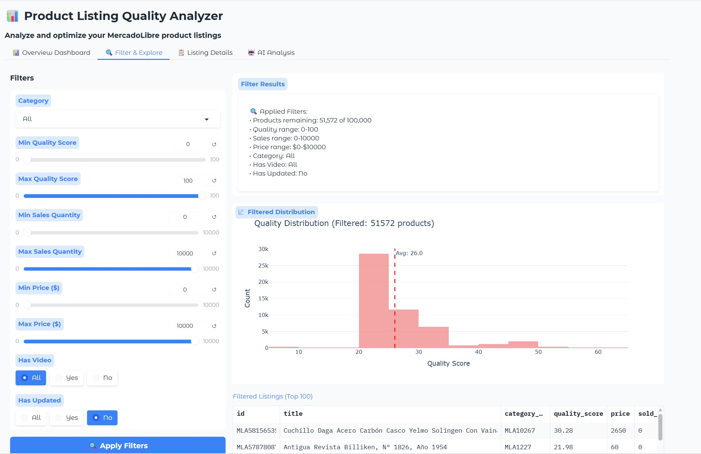

**Problem Understanding: Brief summary of the business problem**  
Within the context of an e-commerce platform, product listing quality is a critical driver of conversion rates and seller success. My objective was to build a quality evaluation framework, analyzing listing and sales data for 100,000 products to generate improvement recommendations for those identified as low quality.

**Methodology**  
Of the 48 columns in the dataset, two are primary quantitative metrics: price and sales volume (sold_quantity). Given the vast product range—from cars to office supplies—I avoided comparing absolute values. Instead, I used each product's **price and sales rank within its specific category** to quantify sales performance. Only categories with more than 10 products were considered (approximately 74% of the data). While sales volume is the core output for the quality score, **price is incorporated to prioritize interventions** (e.g., if adding a video link could boost sales by 10%, it is recommended to focus on higher-value products first).   

The remaining columns consist of qualitative metrics containing detailed product information. From these, I selected the following key factors to construct the scoring system. I also analyzed several other metrics—such as shipping information and picture quality—which were excluded from the final model due to their minimal power to differentiate listing quality.  
> > **Title Length (characters)  
> >Title Quality Score (depending on info density, key elements, placeholder words, repeated words,etc)  
> >Whether it has video  
> >Whether it has been updated  
> >Number of Pictures  
> >Attributes Entry Count  
> >Attributes Completeness**  

The weight assigned to each factor is determined by its correlation coefficient, which quantifies the significance of its impact on a product's sales ranking within its category.  

After implementing the scoring system, products are identified as having low (below the 25th percentile) or median (25th to 50th percentile) quality scores. To maximize return on investment (ROI), a corrective action plan is specifically generated for products that exhibit both a high potential for sales increase and issues that are straightforward to resolve, such as those related to product titles.  

**Key Findings**  
Main insights from EDA  
* quantative metrics:  
>The total sales are 239,699, which indicates a relatively low (2.39) sales per product.  Median price is 250, variation range is very large due to different product types. 99.99% of products never change price since listing is created.  
* qualitative metrics:  
> >* titles: there are 98,823 unique titles grouped under 10,907 categories. Average title length is 45 characters (ranging from 1 to 100). length of title has positive impact on sales with correlation coefficient = 0.625  
> >* video: only 2985 (about 3%) products with video links.   
> >* image: about 33.3% products have 1 picture, about 64.3% have 2-6 pictures. Only 789 products (about 0.8%) are missing pictures. Majority of picture size is 500x375 or 500x500 and majority of max pricture size 1200x900  
> >* update frequency: ~70% of listings have never been updated since creation, ~30% are updated within 2 months.  
> >* attribute completeness: ~87% products have blank attributes, and ~10% have 1 or 2 entries. For those products who have at least one entries, about 80% have complete field information.  entry number (correlation  0.039) and completeness (correlation 0.091 ) both have positive impact on sales.   
> >* shipping info completeness：all products have shipping and there is mininal differentiation regarding completeness.

Distribution of quality scores  
Average quality score is 29.35 with standard deviation of 9.54. Score distribution as shown below indicates relatively poor overall quality. Key drivers are attribute completeness and picture count, which show massive differences between low and high-quality listings. Quality scores vary significantly across categories, with some categories achieving much higher average quality.   
> >Excellent (81-100)  :      0 products (  0.0%)  
> >Good (61-80)        :    733 products (  0.7%)  
> >Fair (41-60)        :   9807 products (  9.8%)  
> >Poor (21-40)        :  83474 products ( 83.5%)  
> >Very Poor (0-20)    :    747 products (  0.7%)  

Patterns identified    
Sales are highly concentrated, with top performers driven by category selection and listing quality rather than price. Key drivers include high attribute completeness, multiple pictures, and updated listings, which strongly correlate with quality scores. However, many listings underperform due to poor quality and incomplete information, despite some having good individual metrics.  

**Recommendations**:  
Top 5 recommendations are:   
1. Implement mandatory attribute completion for key product fields
   Impact: Significant improvement in quality scores, better search relevance, and higher buyer confidence.
   Priority: HIGH
   Difficulty: MEDIUM
2. Set minimum picture requirements (3-5 pictures) for all listings
   Impact: Improved buyer experience, reduced returns, and higher quality scores.
   Priority: HIGH
   Difficulty: EASY
3. Create category-specific quality templates based on top-performing categories
   Impact: Category-wide quality improvements and more consistent standards.
   Priority: MEDIUM
   Difficulty: MEDIUM
4. Develop a 'Quality Improvement Wizard' that guides sellers through the most impactful improvements
   Impact: Rapid quality improvements with minimal seller effort.
   Priority: MEDIUM
   Difficulty: HARD
5. Establish quality score thresholds for search ranking and visibility
   Impact: Increased motivation for sellers to improve listings, leading to platform-wide quality improvements.
   Priority: MEDIUM
   Difficulty: HARD

Based on the assumption products with quality score lower than 25th percentile can be improved by 10%, sales increase is 189 units and revenue increase is $160,972.57. if improved by 25%, sales increase is 473 units and revenue increase is $402,431.43.  

**GenAI Usage**:  
Tools: deepseek  
sample prompt:    
system_prompt = '''
You are an experienced e-commerce optimization specialist for MercadoLibre.
Your expertise is in identifying and fixing non-title related listing quality issues.

NON-TITLE QUALITY FACTORS INCLUDE:
1. Image quality and quantity (picture_count)
2. Video presence (has_video)
3. Listing freshness (has_updated)
4. Attributes completeness (attributes_count, attributes_completeness)
5. Other listing elements that affect conversion rates

Your task is to:
1. Analyze listings with good titles but low overall quality scores
2. Identify the specific non-title issues causing low scores
3. Provide actionable, specific recommendations
4. Focus on quick wins that sellers can implement immediately
'''    
input_prompt = f'''
LISTINGS DATA:
Total listings analyzed: {len(listings_data)}
All listings have: Good title scores (≥70) but Low overall quality scores (≤60)

SAMPLE LISTINGS DATA:
{json.dumps(listings_data[:20], ensure_ascii=False, indent=2)}

TASK:
Based on the non-title metrics provided, identify the 10 LISTINGS WITH THE MOST ACTIONABLE NON-TITLE ISSUES.
For each listing, provide:

1. SPECIFIC ISSUES IDENTIFIED: What non-title factors are causing low scores?
2. BUSINESS IMPACT: How do these issues affect sales/conversions?
3. ACTIONABLE RECOMMENDATIONS: Specific, practical steps to fix each issue
4. ESTIMATED IMPROVEMENT: How much quality score improvement is possible?
5. PRIORITY LEVEL: Based on impact and ease of implementation

FORMAT RESPONSE AS JSON:
{{
  "analysis_summary": {{
    "total_listings_analyzed": {len(listings_data)},
    "most_common_issues": ["list of top 3 most common non-title issues"],
    "quick_wins_available": "percentage of listings with easy fixes",
    "estimated_avg_improvement": "average quality score improvement possible"
  }},
  "top_10_problematic_listings": [
    {{
      "listing_id": "ID",
      "current_overall_score": "number",
      "current_title_score": "number",
      "main_non_title_issues": ["specific issues identified"],
      "business_impact_explanation": "how this affects sales",
      "specific_recommendations": [
        {{
          "action": "specific action to take",
          "reason": "why this helps",
          "difficulty": "easy/medium/hard",
          "expected_improvement": "points improvement"
        }}
      ],
      "overall_improvement_potential": "total points possible",
      "priority_level": "high/medium/low",
      "time_to_implement": "estimated time needed"
    }}
  ],
  "general_recommendations": {{
    "for_listings_with_few_images": ["recommendations"],
    "for_listings_without_videos": ["recommendations"],
    "for_listings_with_poor_attributes": ["recommendations"],
    "for_stale_listings": ["recommendations"]
  }}
}}

Focus on PRACTICAL, ACTIONABLE advice that sellers can implement without technical expertise.
'''  

sample output is shown below  
  

Value delivered  
This diagnostic assessment details the reasons behind low listing quality and outlines corrective action plans. Given the multitude of potential causes, AI efficiently filters and prioritizes the issues offering the highest incremental benefit—that is, those whose resolution would have a quantifiable impact on sales. Consequently, it not only generates considerable savings in time and labor but also ensures that efforts are channeled toward the most critical areas.

**Visualization**  
I used Gradio to build the dashboard for easier intergration with GenAI.  
Overview: show basic stats of quality score and sales info  

Fitler&Explore: with flexible filter, show distribution of key metrics  
  

Listing Details: search for individual product  
  

Al Analysis: pattern and recommendation generated by AI  
 

